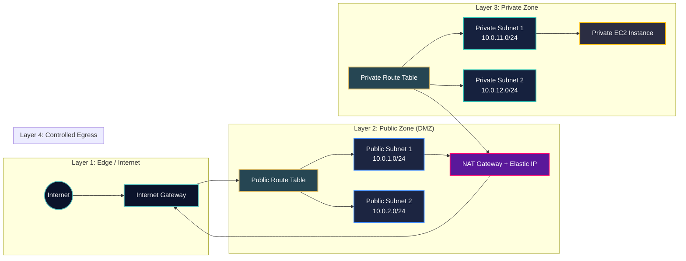

# AWS VPC Terraform Project

## Architecture Overview
This project provisions a production-style VPC foundation:
- 1 VPC (`10.0.0.0/16`)
- 2 public subnets (`10.0.1.0/24`, `10.0.2.0/24`)
- 2 private subnets (`10.0.11.0/24`, `10.0.12.0/24`)
- Internet Gateway for public ingress/egress
- NAT Gateway for private subnet outbound internet access
- Public and private route tables with subnet associations
- Private EC2 instance with VPC-internal access controls

## Architecture Diagram



## Why This Design
- Public subnets host internet-facing network components.
- Private subnets isolate workloads from direct internet exposure.
- NAT enables private workloads to fetch updates without public IPs.
- Multi-AZ subnets improve resilience.

## Resources Created
- `aws_vpc.main`
- `aws_subnet.public_1`
- `aws_subnet.public_2`
- `aws_subnet.private_1`
- `aws_subnet.private_2`
- `aws_internet_gateway.main`
- `aws_eip.nat`
- `aws_nat_gateway.main`
- `aws_route_table.public`
- `aws_route_table.private`
- `aws_route_table_association.*`
- `aws_security_group.private_ec2`
- `aws_instance.private_app`

## How to Use
```bash
terraform init
terraform fmt -recursive
terraform validate
terraform plan
terraform apply
```

## Validation
- Confirm VPC and subnets exist in AWS console.
- Confirm public subnets have route to Internet Gateway.
- Confirm private subnets use private route table with default route to NAT Gateway.
- Confirm private EC2 instance has no public IP.
- Confirm security group allows only VPC-internal SSH/HTTP ingress.

## Cost Notes
- NAT Gateway is a key cost driver in this architecture.
- EC2 instance hourly usage and data transfer can add cost.
- Elastic IP for NAT may incur charges if unused.
- Destroy resources after practice to avoid unnecessary billing.

## Cleanup
```bash
terraform destroy
```